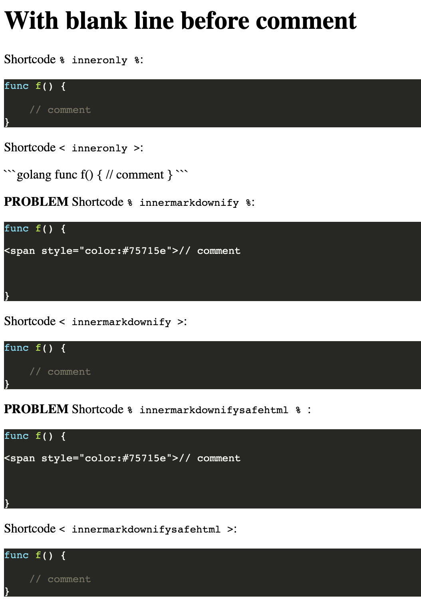
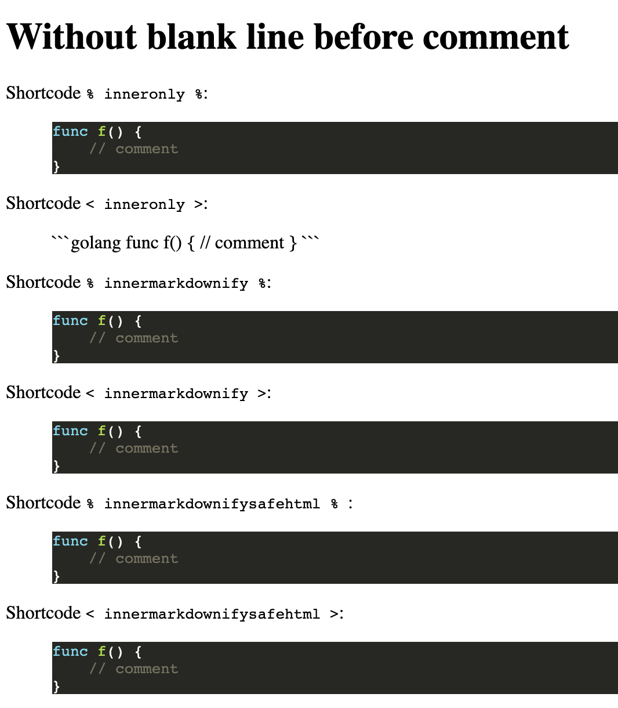

# TL;DR

An issue with rendering code in golang highlight rendering which I encountered in one of my projects and boiled down to this minimal example.

```
➙  hugo version
Hugo Static Site Generator v0.78.2/extended darwin/amd64 BuildDate: unknown
```

TL;DR:
Shorcodes are just rendering the `.Inner` in three flavours:

- bare,
- with `markdownify` and
- `markdownify | safeHTML`),

and then are called in two flavours

- as `{}`
- as ``

The inner code is very simple golang function with a comment.

**Problem**: In two cases (marked as "problem") it is rendered with bare HTML artifact, see screenshots.

**Funny** fact is that if I change the code snippet slightly by removing the blank line, all goes well.

 

# Reproduce

Just clone teh repo, `cd` to this folder and run `hugo serve`.
